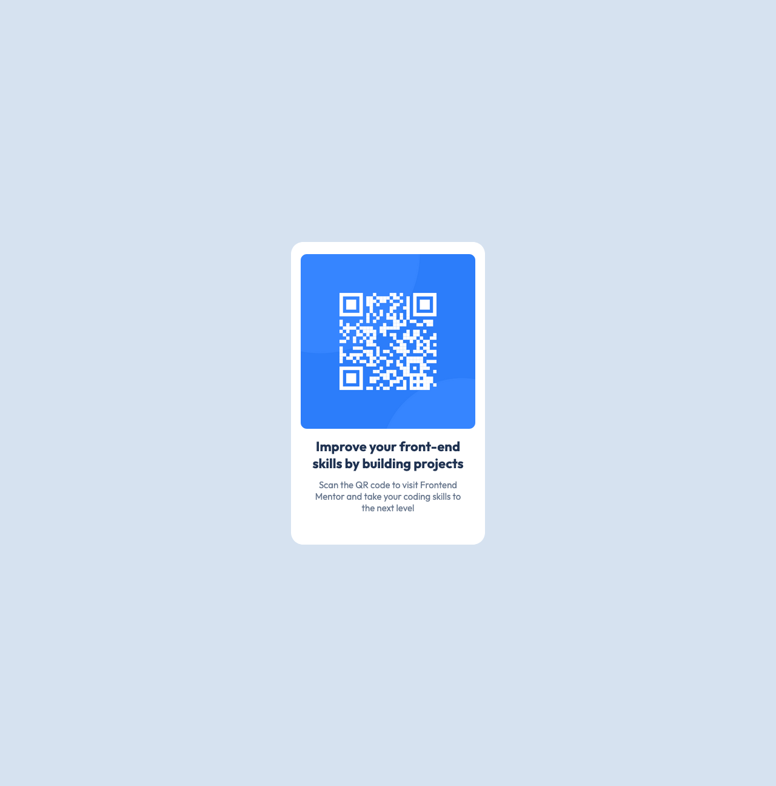

# Frontend Mentor - QR code component solution

  This is a solution to the [QR code component challenge on Frontend Mentor](https://www.frontendmentor.io/challenges/qr-code-component-iux_sIO_H). Frontend Mentor challenges help you improve your coding skills by building realistic projects. 

## Table of contents

- [Overview](#overview)
  - [Screenshot](#screenshot)
  - [Links](#links)
- [My process](#my-process)
  - [Built with](#built-with)
  - [What I learned](#what-i-learned)
  - [Continued development](#continued-development)
  - [Useful resources](#useful-resources)

## Overview

  ### Screenshot
  

  ### Links
  - No links available for this project.

## My process

  ### Built with
    - Semantic HTML5 
    - CSS custom properties

  ### What I learned
    This was a very good starter project. I reinforced writing semantic HTML and creating CSS rules. Also learned how to read and work with Figma and was able to implement using Figma design into my workflow. Learned how to create CSS variables and use them in various rules. 

    Code snippets, see below:

    ```css
    :root {
        --White: hsl(0, 0%, 100%);
        --Slate-300: hsl(212, 45%, 89%);
        --Slate-500: hsl(216, 15%, 48%);
        --Slate-900: hsl(218, 44%, 22%);

    /* --FONTS-- */
        --Outfit: "Outfit", sans-serif;
    }
    ```
  ### Continued development
    Looking forward to future projects.

  ### Useful resources
    Used the first half of this video to jump start this project and where I learned about CSS variables and CSS resetting.
    https://www.youtube.com/watch?v=W_IdN8hMJns
